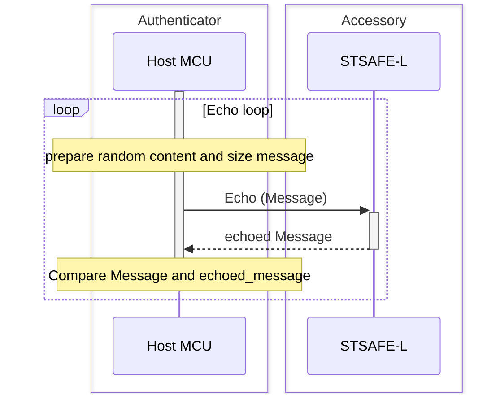
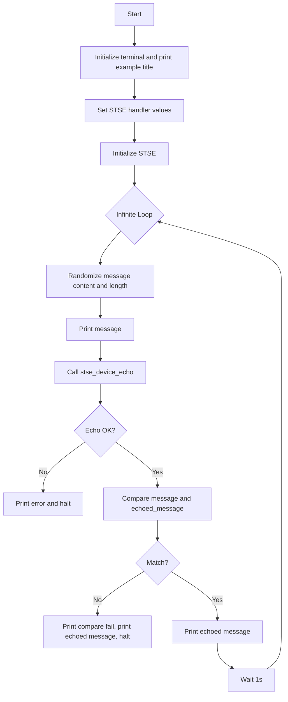

# STSAFE-L Echo Example

This project illustrates how to use the STSAFE-L Secure Element and STMicroelectronics Secure Element Library to perform an echo loop between Host and STSAFE-L Secure Element . Echo loop scenario is usefull for :
- SE integration and stability test
- Accessory hot-plug/presence detection

The example applicative flowchart is illustrated below :

STSELib API used in the example are the following :

- stse_init
- stse_echo

## Hardware and Software Prerequisites

- [NUCLEO-L452RE - STM32L452RE evaluation board](https://www.st.com/en/evaluation-tools/nucleo-l452re.html)

- [X-NUCLEO-ESE01A1 - STSAFE-L010 Secure element expansion board](https://www.st.com/en/ecosystems/x-nucleo-ese01a1.html)

- [STM32CubeIDE - Integrated Development Environment for STM32](https://www.st.com/en/development-tools/stm32cubeide.html)

- Serial terminal PC software  (i.e. Teraterm)

## Getting started with the project

- Connect the [X-NUCLEO-ESE01A1](https://www.st.com/en/ecosystems/x-nucleo-ese01a1.html) expansion board on the top of the [NUCLEO-L452RE](https://www.st.com/en/evaluation-tools/nucleo-l452re.html) evaluation board.

- Connect the board to the development computer and Open and configure a terminal software as follow (i.e. Teraterm).

- Open the STM32CubeIDE projects located in Application/STM32CubeIDE

- Build the project by clicking the “**Build the active configurations of selected projects\ **” button and verify that no error is reported by the GCC compiler/Linker.

- Launch a debug session then wait the debugger to stop on the first main routine instruction and press Start button to execute the main routine.

> [!NOTE]
> - Power configuation Jumper must be set to 3V3-VCC.
> - The COM port can differ from board to board. Please refer to windows device manager.

<b>Result</b> :

This project reports execution log through the on-board STLINK CDC bridge.
These logs can be analyzed on development computer using a serial terminal application (i.e.: Teraterm).
As example below.

<pre>
----------------------------------------------------------------------------------------------------------------
-                                    STSAFE-L Echo loop example                                                -
----------------------------------------------------------------------------------------------------------------
 - Initialize target STSAFE-L010
 ## Message :

  0xCC 0xCC 0xCF 0xB9 0xA2 0x22 0x34 0x0A 0xCC 0xB9 0x57 0xCC 0xFE 0x07 0x80 0x8A
  0xDD 0x70 0xAE 0xC0 0xC0 0x29 0x65 0x82 0x77 0x37 0xE0 0x1D 0x82 0xE5 0x16 0xDD
  0x5F 0x66 0xF6 0xE0 0x9F 0x28 0x48 0x3C 0xDE 0xBE 0xE5 0xDA 0xC7 0x20 0x79 0xE4
  0x84 0x71 0x60 0x16 0xB8 0x89 0x6E 0x04 0x1B 0x79 0x3D 0x54 0xF6 0xCF 0x1C 0xB6
  0x1C 0x6C 0x0B 0xBC 0xB1 0x3A 0x4A 0x69 0x2B 0xFE 0xB6 0xDD 0x16 0xA1 0xDA 0x88
  0xCE 0xDC 0xF2 0x64 0x35 0x69 0x57 0x5B 0x26 0xA7 0xE2 0xDC 0x64 0x7F 0xC6 0x14
  0xED 0x5B 0x06 0x47 0xF1 0x5D 0x4A 0x6A 0x01 0xFE 0x3C 0x01 0x0C 0x93 0xEB 0x7A
  0x67 0x50 0x60 0x54 0xB5 0xED 0xB5 0x80 0x88 0x79 0x38 0x11 0x54 0x36 0x4B 0xC6
  0x61 0x78 0x7E 0x67 0x90 0xA6 0x93 0x37 0x7E 0x84 0xBF 0xE7 0xA9 0x30 0x24 0x84
  0xCD 0xBD 0xBD 0x72 0x1E 0x46 0x88 0x64 0x9A 0x3A 0x6E 0xE3 0x41 0x4E 0x85 0x6E
  0x48 0xA8 0x74 0x79 0x8F 0x64 0x95 0x09 0x74 0x84 0x33 0xCE 0xC0 0x66 0x86 0xF6
  0x4A 0xAF 0x33 0xF9 0x17 0x2F 0x63 0xAE 0x43 0x6E 0x6E 0x05 0x78 0x22 0x8E 0x17
  0xF1 0x80 0xA8 0xC3 0x7C 0x1D 0x52 0xFE 0xD9 0x3D 0xDB 0x70 0x6F 0xEF 0xC6 0x1C
  0x37 0x06 0xC1 0x5D 0x0E 0x34 0xD5 0x68 0xAE 0x74 0x10 0x56 0xFF 0xDE 0x67 0x7B
  0xD3 0x93 0xC9 0x11 0xF5 0xFC 0x66 0x8C 0x6B 0x89 0x20 0xAA 0xF9 0xCF 0x12 0xBA
  0x30 0xB6 0xB7 0x1D 0x67 0xB2 0x38 0xFD 0x64 0x9B 0xBA 0x15 0x33 0x3C 0xF2 0xB4
  0xDB 0xD5 0xFD 0x8E 0x6D 0x4C 0xE8 0x20 0x20 0xD6 0x87 0xDB 0xA9 0x35 0x78 0xD2
  0xE7 0xD2 0xFC 0x26 0xE0 0x97 0x06 0x33 0x45 0xF3 0x38 0x48 0xC6 0x71 0x15 0x85
  0x2B 0xBE 0x9A 0x76 0x7D 0x8C 0xE9 0x96 0x41 0x6C 0x38 0x54 0x4C 0x12 0x13 0x10
  0x06 0x61 0x5F 0x50 0xA0 0xB4 0x33 0x43 0x17 0x0C 0x07 0xC5 0x03 0xFD 0x3F 0xC7
  0x02 0x6A 0xBD 0x3B 0xE6 0x75 0xD7 0xF4 0x71 0x42 0x21 0x97 0x9A 0xF7 0x1F 0x51
  0x14 0xCB 0x6D 0x47 0x73 0x34 0xC3 0x49 0x26 0xE3 0xA7 0x74 0xCF 0x11 0x68 0xB8
  0x88 0x42 0x35 0x39 0x6C 0xAA 0xA6 0x5D 0x1B 0x00 0x06 0xE5

 ## Echoed Message :

  0xCC 0xCC 0xCF 0xB9 0xA2 0x22 0x34 0x0A 0xCC 0xB9 0x57 0xCC 0xFE 0x07 0x80 0x8A
  0xDD 0x70 0xAE 0xC0 0xC0 0x29 0x65 0x82 0x77 0x37 0xE0 0x1D 0x82 0xE5 0x16 0xDD
  0x5F 0x66 0xF6 0xE0 0x9F 0x28 0x48 0x3C 0xDE 0xBE 0xE5 0xDA 0xC7 0x20 0x79 0xE4
  0x84 0x71 0x60 0x16 0xB8 0x89 0x6E 0x04 0x1B 0x79 0x3D 0x54 0xF6 0xCF 0x1C 0xB6
  0x1C 0x6C 0x0B 0xBC 0xB1 0x3A 0x4A 0x69 0x2B 0xFE 0xB6 0xDD 0x16 0xA1 0xDA 0x88
  0xCE 0xDC 0xF2 0x64 0x35 0x69 0x57 0x5B 0x26 0xA7 0xE2 0xDC 0x64 0x7F 0xC6 0x14
  0xED 0x5B 0x06 0x47 0xF1 0x5D 0x4A 0x6A 0x01 0xFE 0x3C 0x01 0x0C 0x93 0xEB 0x7A
  0x67 0x50 0x60 0x54 0xB5 0xED 0xB5 0x80 0x88 0x79 0x38 0x11 0x54 0x36 0x4B 0xC6
  0x61 0x78 0x7E 0x67 0x90 0xA6 0x93 0x37 0x7E 0x84 0xBF 0xE7 0xA9 0x30 0x24 0x84
  0xCD 0xBD 0xBD 0x72 0x1E 0x46 0x88 0x64 0x9A 0x3A 0x6E 0xE3 0x41 0x4E 0x85 0x6E
  0x48 0xA8 0x74 0x79 0x8F 0x64 0x95 0x09 0x74 0x84 0x33 0xCE 0xC0 0x66 0x86 0xF6
  0x4A 0xAF 0x33 0xF9 0x17 0x2F 0x63 0xAE 0x43 0x6E 0x6E 0x05 0x78 0x22 0x8E 0x17
  0xF1 0x80 0xA8 0xC3 0x7C 0x1D 0x52 0xFE 0xD9 0x3D 0xDB 0x70 0x6F 0xEF 0xC6 0x1C
  0x37 0x06 0xC1 0x5D 0x0E 0x34 0xD5 0x68 0xAE 0x74 0x10 0x56 0xFF 0xDE 0x67 0x7B
  0xD3 0x93 0xC9 0x11 0xF5 0xFC 0x66 0x8C 0x6B 0x89 0x20 0xAA 0xF9 0xCF 0x12 0xBA
  0x30 0xB6 0xB7 0x1D 0x67 0xB2 0x38 0xFD 0x64 0x9B 0xBA 0x15 0x33 0x3C 0xF2 0xB4
  0xDB 0xD5 0xFD 0x8E 0x6D 0x4C 0xE8 0x20 0x20 0xD6 0x87 0xDB 0xA9 0x35 0x78 0xD2
  0xE7 0xD2 0xFC 0x26 0xE0 0x97 0x06 0x33 0x45 0xF3 0x38 0x48 0xC6 0x71 0x15 0x85
  0x2B 0xBE 0x9A 0x76 0x7D 0x8C 0xE9 0x96 0x41 0x6C 0x38 0x54 0x4C 0x12 0x13 0x10
  0x06 0x61 0x5F 0x50 0xA0 0xB4 0x33 0x43 0x17 0x0C 0x07 0xC5 0x03 0xFD 0x3F 0xC7
  0x02 0x6A 0xBD 0x3B 0xE6 0x75 0xD7 0xF4 0x71 0x42 0x21 0x97 0x9A 0xF7 0x1F 0x51
  0x14 0xCB 0x6D 0x47 0x73 0x34 0xC3 0x49 0x26 0xE3 0xA7 0x74 0xCF 0x11 0x68 0xB8
  0x88 0x42 0x35 0x39 0x6C 0xAA 0xA6 0x5D 0x1B 0x00 0x06 0xE5
----------------------------------------------------------------------------------------------------------------
</pre>
